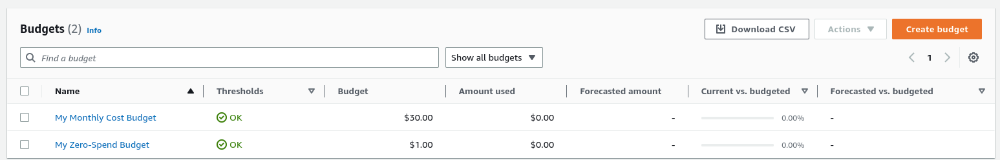
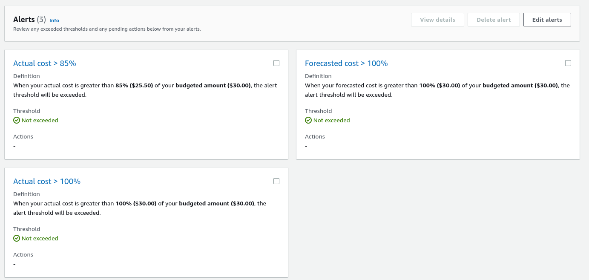
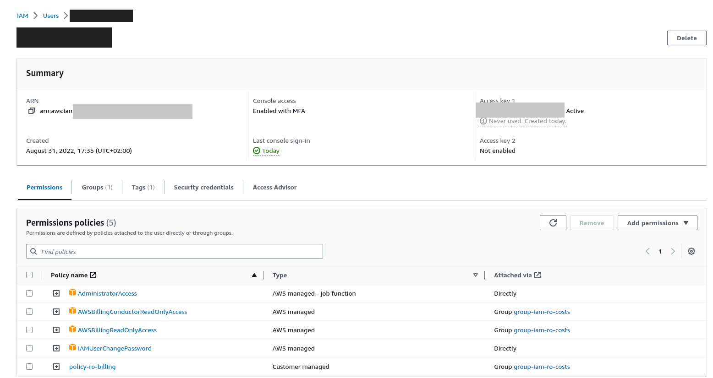
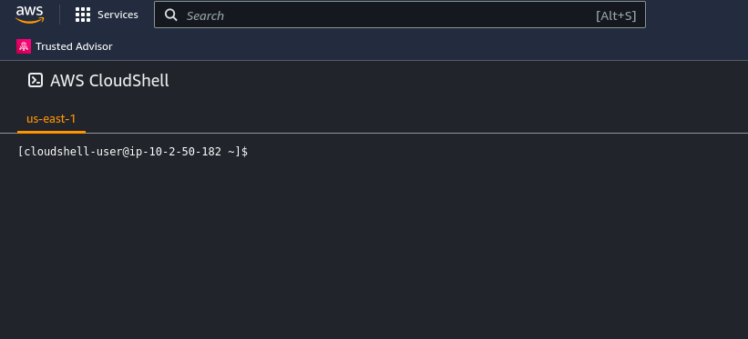
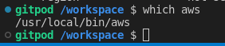
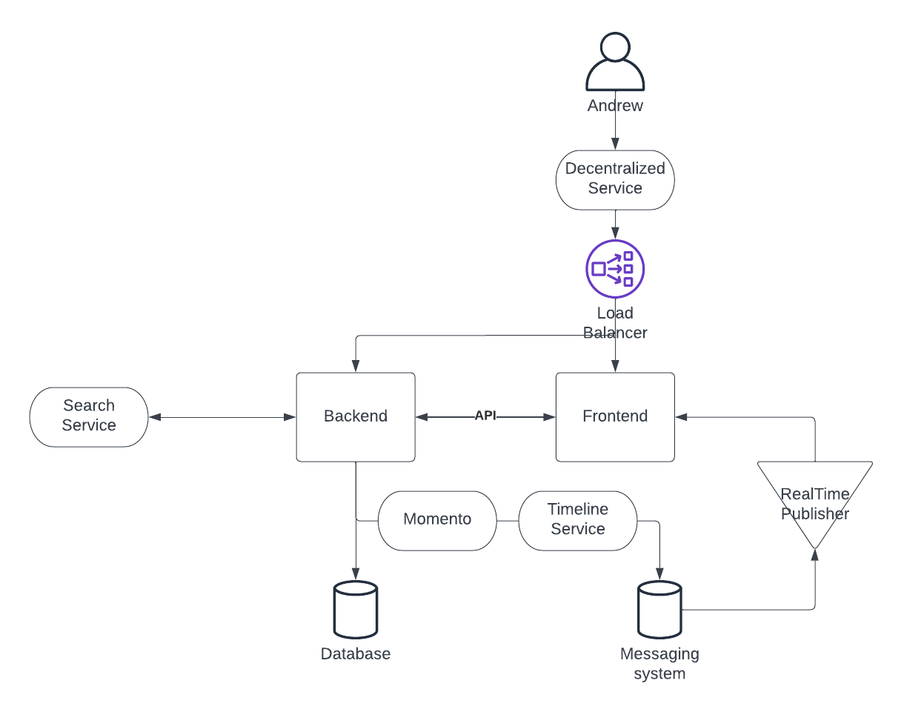
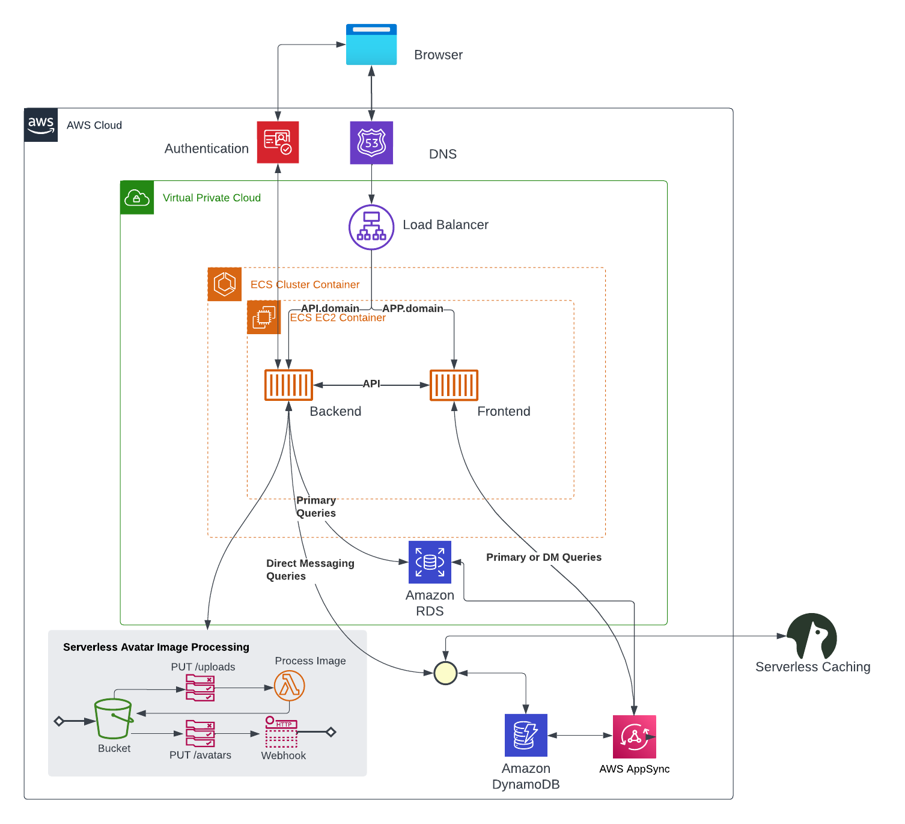
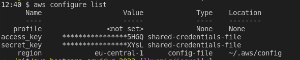

# Week 0 — Billing and Architecture

## Homework Hard Assignments

1. Set a billing alarm

    TODO: Utilize [this instructions](https://aws.amazon.com/premiumsupport/knowledge-center/cloudwatch-estimatedcharges-alarm/) or [alarm_config](https://github.com/omenking/aws-bootcamp-cruddur-2023/blob/week-1/aws/json/alarm_config.json.example) or [via console](https://www.youtube.com/watch?v=OVw3RrlP-sI&list=PLBfufR7vyJJ7k25byhRXJldB5AiwgNnWv&index=14).

    TODO: Watch [this](https://www.youtube.com/watch?v=4EMWBYVggQI&list=PLBfufR7vyJJ7k25byhRXJldB5AiwgNnWv&index=12)

    ```bash
    aws cloudwatch put-metric-alarm --cli-input-json file://aws/json/alarm_config.json
    ```

2. Set a AWS Budget 

    No free tier, hence actually only monthy budget counts...

    ```bash
    aws budgets describe-budget --budget-name "My Monthly Cost Budget" --account-id $AWS_ACCOUNT_ID
    aws budgets describe-budget --budget-name "My Zero-Spend Budget" --account-id $AWS_ACCOUNT_ID

    ```

    

   

    ```yaml
    {
        "Budget": {
            "BudgetName": "My Monthly Cost Budget",
            "BudgetLimit": {
                "Amount": "30.0",
                "Unit": "USD"
            },
            "CostFilters": {},
            "CostTypes": {
                "IncludeTax": true,
                "IncludeSubscription": true,
                "UseBlended": false,
                "IncludeRefund": false,
                "IncludeCredit": false,
                "IncludeUpfront": true,
                "IncludeRecurring": true,
                "IncludeOtherSubscription": true,
                "IncludeSupport": true,
                "IncludeDiscount": true,
                "UseAmortized": false
            },
            "TimeUnit": "MONTHLY",
            "TimePeriod": {
                "Start": "2023-02-01T01:00:00+01:00",
                "End": "2087-06-15T02:00:00+02:00"
            },
            "CalculatedSpend": {
                "ActualSpend": {
                    "Amount": "0.0",
                    "Unit": "USD"
                }
            },
            "BudgetType": "COST",
            "LastUpdatedTime": "2023-02-12T11:16:49.153000+01:00"
        }
    }
    ```

    ```yaml
    {
        "Budget": {
            "BudgetName": "My Zero-Spend Budget",
            "BudgetLimit": {
                "Amount": "1.0",
                "Unit": "USD"
            },
            "CostFilters": {},
            "CostTypes": {
                "IncludeTax": true,
                "IncludeSubscription": true,
                "UseBlended": false,
                "IncludeRefund": false,
                "IncludeCredit": false,
                "IncludeUpfront": true,
                "IncludeRecurring": true,
                "IncludeOtherSubscription": true,
                "IncludeSupport": true,
                "IncludeDiscount": true,
                "UseAmortized": false
            },
            "TimeUnit": "MONTHLY",
            "TimePeriod": {
                "Start": "2023-02-01T01:00:00+01:00",
                "End": "2087-06-15T02:00:00+02:00"
            },
            "CalculatedSpend": {
                "ActualSpend": {
                    "Amount": "0.0",
                    "Unit": "USD"
                }
            },
            "BudgetType": "COST",
            "LastUpdatedTime": "2023-02-12T11:17:45.444000+01:00"
        }
    }    
    ```

3. Generating AWS Credentials 

    


4. Using CloudShell 

    

    The `aws cli` was installed into the gitpod environment. See the `.gitpod.yml`

    

    To add configuration to the [gitpod environments](https://www.gitpod.io/docs/configure/projects/environment-variables) (persistent throught sessions):

    ```bash
    # setting the persistent gitpod environment values
    gp env AWS_ACCESS_KEY_ID="key_id"
    gp env AWS_SECRET_ACCESS_KEY="secret_access_key"
    gp env AWS_DEFAULT_REGION="eu-central-1"
    # importing them to the local session 
    eval $(gp env -e)
    # listing current bash env
    env | grep AWS
    aws sts get-caller-identity
    ```

    This is a one time action. 

    **NOTE:** This might impose security risk, as the CLI keys are not expirable by default. Needs further investigation on best practice for expiration. 

5. Conceptual Architecture Diagram or your Napkins [Live-Stream]
        
    
    *Napkin Design*

    
    *Architectural Design*

## Homework Stretch Assignments

1. Destroy your root account credentials, Set MFA, IAM role

    *Completed in hard assignments already.*

 2. Use EventBridge to hookup Health Dashboard to SNS and send notification when there is a service health issue.

 3. Review all the questions of each pillars in the Well Architected Tool (No specialized lens)

    *Completed.*

 4. Create an architectural diagram (to the best of your ability) the CI/CD logical pipeline in Lucid Charts

 5. Research the technical and service limits of specific services and how they could impact the technical path for technical flexibility.

 6. Open a support ticket and request a service limit

    *N/A*

## Additional configuration

1. Since I have made a decision to duplicate the Gitpod env within my local state, I had to configure the `aws cli` locally. All instrusctions, including completion are within the [aws docs](https://aws.amazon.com/cli/)

