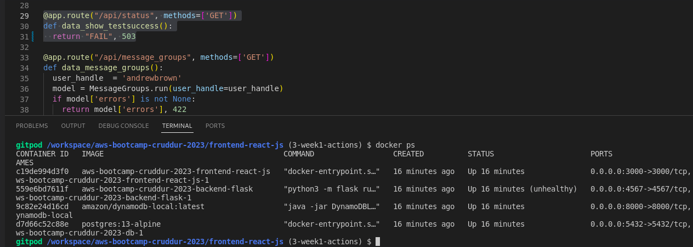
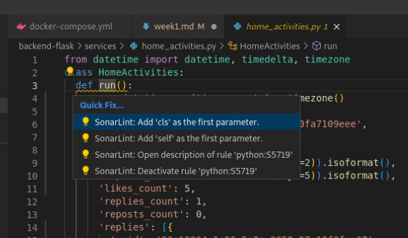
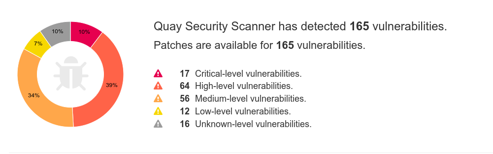
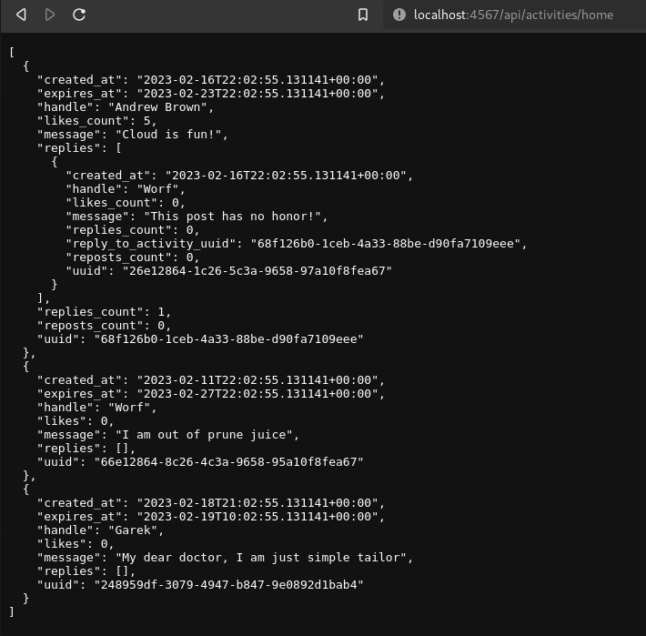
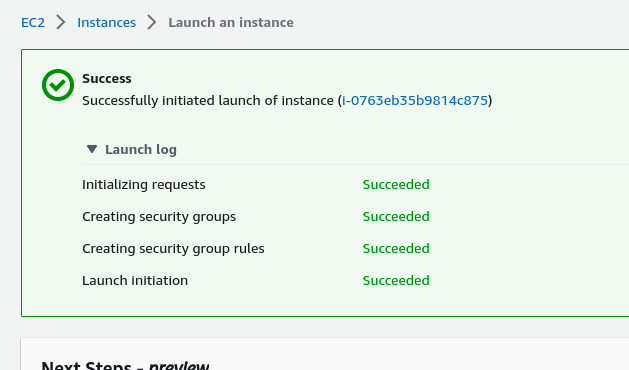
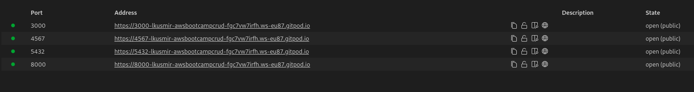
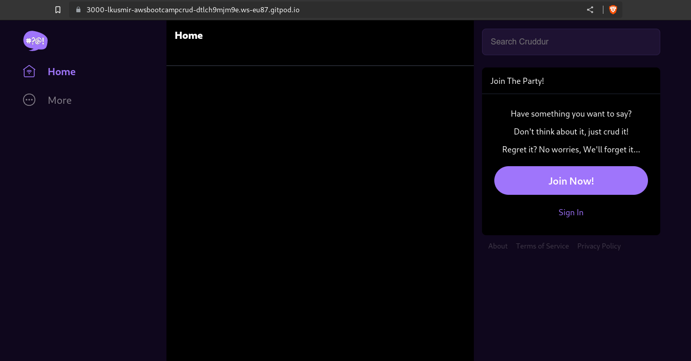

# Week 1 — App Containerization

## Home assignment

1. Run the docker CMD as en external script.

Somewhere within the Dockerfile we have to copy the script into the container
```bash
COPY ./startup.sh /startup.sh
```
Then the use the CMD command to run it:
```bash
MCD ["/bin/bash","/startup.sh"]
```

This might be usefull when:
* tweaking runtime parameters based on prerun conditions
* diagnosing the process - run loop with `sleep`
* running more than one command - a bit obvious; running dockers to process and finish 

2. Push and tag an image to dockerhub

  * Pushing the image to [dockerhub](https://hub.docker.com)
  
  ```bash
  # Login to repository
  $ docker login docker.io
  Authenticating with existing credentials...
  Login Succeeded
  # Tag images appropriately
  $ docker tag backend-flask:1.0-SNAPSHOT lkusmir/backend-flask:1.0-SNAPSHOT
  $ docker tag backend-flask:1.1-SNAPSHOT lkusmir/backend-flask:1.1-SNAPSHOT
  $ docker tag backend-flask:latest lkusmir/backend-flask
  $ docker tag frontend-react-js:1.0-SNAPSHOT lkusmir/frontend-react-js:1.0-SNAPSHOT
  $ docker tag frontend-react-js:1.1-SNAPSHOT lkusmir/frontend-react-js:1.1-SNAPSHOT
  $ docker tag frontend-react-js:latest lkusmir/frontend-react-js
  $ docker image list 
  lkusmir/frontend-react-js                     1.1-SNAPSHOT        55eeb3e3cc5e        23 hours ago        1.2GB
  lkusmir/frontend-react-js                     latest              55eeb3e3cc5e        23 hours ago        1.2GB
  lkusmir/backend-flask                         1.1-SNAPSHOT        e19dd292f3ed        24 hours ago        129MB
  lkusmir/backend-flask                         latest              e19dd292f3ed        24 hours ago        129MB
  lkusmir/frontend-react-js                     1.0-SNAPSHOT        aa76de3305c7        40 hours ago        1.2GB
  lkusmir/backend-flask                         1.0-SNAPSHOT        1cd618986456        40 hours ago        129MB

  # Push the tempo, push the tempo
  # Note some layers are already mounted by library/node :)
  $ docker push lkusmir/frontend-react-js
  The push refers to repository [docker.io/lkusmir/frontend-react-js]
  3ca38fa3fd88: Pushed 
  67232742a947: Pushed 
  8dcc2270b2a4: Mounted from library/node 
  60a3cb9a013a: Mounted from library/node 
  31880ac21a09: Mounted from library/node 
  86b22c61669b: Mounted from library/node 
  dec5d443c5c1: Mounted from library/node 
  753fac84fc56: Mounted from library/node 
  81fcd676802f: Mounted from library/node 
  6a1754327612: Mounted from library/node 
  3943af3b0cbd: Mounted from library/node 
  1.0-SNAPSHOT: digest: sha256:ed2f8bda0eee4a7039814d0a168f2870a436a0f8663246344e06a3856f62bfd4 size: 2639
  (...)
  lkusmir/backend-flask                         1.0-SNAPSHOT        1cd618986456        40 hours ago        129MB
  (...)
  lkusmir/backend-flask                         1.0-SNAPSHOT        1cd618986456        40 hours ago        129MB

  $ docker push lkusmir/backend-flask
  The push refers to repository [docker.io/lkusmir/backend-flask]1.0-SNAPSHOT: digest: sha256:b70f4f0c30fe04148444135422ee8e3a456548106befb2ebcfea37c12fcb253b size: 2203
  1.1-SNAPSHOT: digest: sha256:8ab8998936457e3f5a71e823fef52621aaf08934d008eb4171c0ba9fb288fccb size: 2203
  latest: digest: sha256:8ab8998936457e3f5a71e823fef52621aaf08934d008eb4171c0ba9fb288fccb size: 2203
  # Images can be pushed if required
  $ docker pull lkusmir/frontend-react-js
  Using default tag: latest
  docker pulatest: Pulling from lkusmir/frontend-react-js
  Digest: sha256:dab06c5e9d5d045eb28026577307e2610c41432255527cdc87674647eba5cc84
  Status: Image is up to date for lkusmir/frontend-react-js:latest
  $ docker pull lkusmir/backend-flask
  Using default tag: latest
  latest: Pulling from lkusmir/backend-flask
  Digest: sha256:8ab8998936457e3f5a71e823fef52621aaf08934d008eb4171c0ba9fb288fccb
  Status: Image is up to date for lkusmir/backend-flask:latest
  ```

  * Pushing the image to [quay.io](https://quay.io) repository (since why not).

  ```bash
  # Login to repository
  $ docker login quay.io
  Authenticating with existing credentials...
  Login Succeeded
  # Tag images appropriately
  $ docker tag backend-flask:1.0-SNAPSHOT quay.io/lkusmir/snapshots/backend-flask:1.0-SNAPSHOT
  $ docker tag backend-flask:1.1-SNAPSHOT quay.io/lkusmir/snapshots/backend-flask:1.1-SNAPSHOT
  $ docker tag backend-flask:1.1-SNAPSHOT quay.io/lkusmir/snapshots/backend-flask
  $ docker tag frontend-react-js:1.0-SNAPSHOT quay.io/lkusmir/snapshots/frontend-react-js:1.0-SNAPSHOT
  $ docker tag frontend-react-js:1.1-SNAPSHOT quay.io/lkusmir/snapshots/frontend-react-js:1.1-SNAPSHOT
  $ docker tag frontend-react-js:1.1-SNAPSHOT quay.io/lkusmir/snapshots/frontend-react-js
  $ docker image list | grep quay
  quay.io/lkusmir/snapshots/frontend-react-js   1.1-SNAPSHOT        55eeb3e3cc5e        22 hours ago        1.2GB
  quay.io/lkusmir/snapshots/frontend-react-js   latest              55eeb3e3cc5e        22 hours ago        1.2GB
  quay.io/lkusmir/snapshots/backend-flask       1.1-SNAPSHOT        e19dd292f3ed        22 hours ago        129MB
  quay.io/lkusmir/snapshots/backend-flask       latest              e19dd292f3ed        22 hours ago        129MB
  quay.io/lkusmir/snapshots/frontend-react-js   1.0-SNAPSHOT        aa76de3305c7        38 hours ago        1.2GB
  quay.io/lkusmir/snapshots/backend-flask       1.0-SNAPSHOT        1cd618986456        38 hours ago        129MB

  # Push images to repository
  $ docker push quay.io/lkusmir/snapshots/backend-flask 
  The push refers to repository [quay.io/lkusmir/snapshots/backend-flask]
  1.0-SNAPSHOT: digest: sha256:b70f4f0c30fe04148444135422ee8e3a456548106befb2ebcfea37c12fcb253b size: 2203
  1.1-SNAPSHOT: digest: sha256:8ab8998936457e3f5a71e823fef52621aaf08934d008eb4171c0ba9fb288fccb size: 2203
  latest: digest: sha256:8ab8998936457e3f5a71e823fef52621aaf08934d008eb4171c0ba9fb288fccb size: 2203
  $ docker push quay.io/lkusmir/snapshots/frontend-react-js
  The push refers to repository [quay.io/lkusmir/snapshots/frontend-react-js]
  1.0-SNAPSHOT: digest: sha256:ed2f8bda0eee4a7039814d0a168f2870a436a0f8663246344e06a3856f62bfd4 size: 2639
  1.1-SNAPSHOT: digest: sha256:dab06c5e9d5d045eb28026577307e2610c41432255527cdc87674647eba5cc84 size: 2639
  latest: digest: sha256:dab06c5e9d5d045eb28026577307e2610c41432255527cdc87674647eba5cc84 size: 2639
  # Note: then pushing newer version - some layers already existed ;)
  # the upload is completed. The containers are available. Additionally I've marked the 1.1-SNAPSHOT with the `latest` tag
  $ docker pull quay.io/lkusmir/snapshots/frontend-react-js
  Using default tag: latest
  latest: Pulling from lkusmir/snapshots/frontend-react-js
  Digest: sha256:dab06c5e9d5d045eb28026577307e2610c41432255527cdc87674647eba5cc84
  Status: Image is up to date for quay.io/lkusmir/snapshots/frontend-react-js:latest
  $ docker pull quay.io/lkusmir/snapshots/frontend-react-js
  Using default tag: latest
  latest: Pulling from lkusmir/snapshots/frontend-react-js
  Digest: sha256:dab06c5e9d5d045eb28026577307e2610c41432255527cdc87674647eba5cc84
  Status: Image is up to date for quay.io/lkusmir/snapshots/frontend-react-js:latest
  ```

3. Multistage building for a Dockerfile

  [Reference](https://docs.docker.com/develop/develop-images/dockerfile_best-practices/#use-multi-stage-builds).

  Example multistage build of the frontend is in the [Dockerfile-multistage](../frontend-react-js/Dockerfile-multistage). It builds the image using the node image, then runs it in nginx, again decreasing the footprint.

  ```bash
  $ docker build -f Dockerfile-multistage -t lkusmir/frontend-react-js:1.6-MULTISTAGE . 
  $ docker image list
  lkusmir/frontend-react-js                     1.6-MULTISTAGE      6c7b4c9af206        45 seconds ago       307MB
  lkusmir/frontend-react-js                     1.5-SNAPSHOT        0ad365dbe431        4 days ago           683MB
  ```

4. Implement a healthcheck in the V3 Docker compos file

  Relevant documentation:
  * [compose healthcheck](https://docs.docker.com/compose/compose-file/compose-file-v3/)
  * [docker docs](https://docs.docker.com/engine/reference/builder/#healthcheck)

  Added a simplistic API Endpoint `/api/status` to the Backend and a Healthcheck to `docker-compose.yml`.
  Performed a check - works as exptected.
    
  *Docker status check*

  Added a Frontend Healthcheck appropriately. 

5. Research best practices of Dockerfile and attempt to implement it in your Dockerfile
  
  Resources:
  * [Docker Node.js app best practices](https://snyk.io/blog/10-best-practices-to-containerize-nodejs-web-applications-with-docker/)
  * [Docker pythong app best practices](https://testdriven.io/blog/docker-best-practices/)
  Some of the [best practices](https://docs.docker.com/develop/develop-images/dockerfile_best-practices/) implemented:

  * Application code [testing for vulnerabilites](https://sonarcloud.io/project/overview?id=lkusmir_aws-bootcamp-cruddur-2023) before production use. Shift left when possible.

    
  *Sonar code quality scan within IDE*

  * Artifacts scanning for vulnerabilites

  Here we could use of of the tools available on the market, tor example Jfrog Xray (non-free). Most of the repositories have some kind of security scan enabled. Check out the results for the [frontend](https://quay.io/repository/lkusmir/snapshots/frontend-react-js/manifest/sha256:dab06c5e9d5d045eb28026577307e2610c41432255527cdc87674647eba5cc84?tab=vulnerabilities) and [backend](https://quay.io/repository/lkusmir/snapshots/backend-flask/manifest/sha256:8ab8998936457e3f5a71e823fef52621aaf08934d008eb4171c0ba9fb288fccb?tab=vulnerabilities) image scan with [Clair](https://quay.github.io/clair/howto/testing.html).

    
  *Example scan result*

* Keeping runtimes updated 

  Added apt to BackEnd and Frontend Dockerfile. This alone actually reduced the number of vulnerabilites [here](https://quay.io/repository/lkusmir/snapshots/frontend-react-js?tab=tags) . 

* Declare 'cheap' commands as late as possible, aka command order matters

  For example, early declaration of `ENV` within Frontends Dockerfile was an antipattern.
  Before:

  ```control
  $ docker history frontend-react-js:1.2-SNAPSHOT 
  IMAGE               CREATED             CREATED BY                                      SIZE                COMMENT
  cd90f77ff81b        About an hour ago   /bin/sh -c #(nop)  CMD ["npm" "start"]          0B                  
  66046061e4e7        About an hour ago   /bin/sh -c #(nop)  EXPOSE 3000                  0B                  
  3933fc1b642d        About an hour ago   /bin/sh -c npm install                          123MB               
  b6e8f29d3537        About an hour ago   /bin/sh -c #(nop) WORKDIR /frontend-react-js    0B                  
  27bdd30a1bd0        About an hour ago   /bin/sh -c #(nop) COPY dir:138a2d4caa281b02c…   169MB               
  ecef87c5a3e6        About an hour ago   /bin/sh -c #(nop)  ENV PORT=3000                0B                  
  8fefff9fe08d        About an hour ago   /bin/sh -c apt-get update && apt-get full-up…   90MB 
  ```

  After:

  ```control
  $ docker history frontend-react-js:1.3-SNAPSHOT 
  IMAGE               CREATED              CREATED BY                                      SIZE                COMMENT
  6c1c09cf7fc6        13 seconds ago       /bin/sh -c #(nop)  CMD ["npm" "start"]          0B                  
  899214feeed2        13 seconds ago       /bin/sh -c #(nop)  EXPOSE 3000                  0B                  
  1a1a6d5a9735        14 seconds ago       /bin/sh -c #(nop)  ENV PORT=3000                0B                  
  ef9c70c2545d        15 seconds ago       /bin/sh -c npm install                          123MB               
  cc708723d0ff        About a minute ago   /bin/sh -c #(nop) WORKDIR /frontend-react-js    0B                  
  87487ed8136c        About a minute ago   /bin/sh -c #(nop) COPY dir:3259f6d1ab501d39f…   169MB               
  8fefff9fe08d        About an hour ago    /bin/sh -c apt-get update && apt-get full-up…   90MB  
  ```
* Explicitly declare versions of the image, don't rely on `lastest`. Within the Dockerfile also try to define the exact versions of requirements, for example when installing prereqs, or with the `FROM` directive.

* Label it - add Metadata to an image - kv format

  Labels were added to Dockerfiles.

* No sensitive data in docker files or images - use envs or vault

* Use [RO filesystems](https://docs.docker.com/storage/volumes/#use-a-read-only-volume) for Volumes with static data

Can be utilized for the frontend, backend volumes. Simply append `,ro` to the definition.

* The Best Practce for Day0 tutorial suggested having separate Repositories for LTS - I is a good practice to some extend, but actually I'd recommend treating all artifacts as ephemeral. The only source of truth should be within the code. Don't estimate the container has to last within repo for longer than the build process. This leads to a lot of debt and overhead if we relay on artifacts instead of code and CI.

* Friends don't let friends run containers as root!

  The official node Docker image, as well as its variants like alpine, include a least-privileged user of the same name: node.
  The Frontend Dockerfile has been reconfigured to use non-root user.

  ```bash
  $ docker ps 
  CONTAINER ID        IMAGE                       COMMAND                  CREATED             STATUS              PORTS                    NAMES
  8320c7750d55        lkusmir/frontend-react-js   "docker-entrypoint.s…"   2 minutes ago       Up 2 minutes        0.0.0.0:3000->3000/tcp   musing_kepler
  $ docker exec -it 8320c7750d55caeccbabfa59921532ee632df6abbb011d001fc617f16bb62507 id
  uid=1000(node) gid=1000(node) groups=1000(node)
  ```

[Usefull document](https://snyk.io/blog/10-best-practices-to-containerize-nodejs-web-applications-with-docker/) on using the `node` user for Node.js application.

**WARNING:** This might actaully impact the GITPOD "live editing" as we're mapping volumes over the container.

* KISS - small is good
    - [`.dockerignore`](https://docs.docker.com/engine/reference/builder/#dockerignore-file)
    - look for smallest possible `FROM` images matching your reqs - substituted Frontend `FROM` to use the slim distro; could further improve by rewrite to `alpine`

  Here's the size difference post implementation of `slim`:
  ```
  REPOSITORY                                    TAG                 IMAGE ID            CREATED             SIZE
  frontend-react-js                             1.4-SNAPSHOT        f03e3e300e6e        8 minutes ago       485MB
  frontend-react-js                             1.3-SNAPSHOT        6c1c09cf7fc6        About an hour ago   1.29GB
  ```

6. Learn how to install Docker on your localmachine and get the same containes running outside of Gitpod/codespaces

    [Installation procedure](https://docs.docker.com/engine/install/debian/) on my local machine.

    Building and running the application locally:
    ```bash
    $ pwd
    /home/lkusmir/git/aws-bootcamp-cruddur-2023/backend-flask

    $ docker build -t backend-flask:1.0-SNAPSHOT .
    Sending build context to Docker daemon  33.79kB
    (...)
    Successfully built 1cd618986456
    Successfully tagged backend-flask:1.0-SNAPSHOT

    $ pwd
    /home/lkusmir/git/aws-bootcamp-cruddur-2023/frontend-react-js

    $ npm i
    added 1470 packages from 685 contributors and audited 1471 packages in 100.818s
    (...)

    $ docker build -t frontend-react-js:1.0-SNAPSHOT .
    Successfully built aa76de3305c7
    Successfully tagged frontend-react-js:1.0-SNAPSHOT

    $ docker image list
    REPOSITORY                                    TAG                 IMAGE ID            CREATED             SIZE
    frontend-react-js                             1.0-SNAPSHOT        aa76de3305c7        32 seconds ago      1.2GB
    backend-flask                                 1.0-SNAPSHOT        1cd618986456        14 minutes ago      129MB

    $ docker run -e FRONTEND_URL="*" -e BACKEND_URL="*" -d -p 4567:4567 backend-flask:1.0-SNAPSHOT
    87ea942d63221c13e9a49ee36840a9dcdbddacd25991a63b1382f96e7a19601b
    $ docker run -e REACT_APP_BACKEND_URL="http://localhost:4567" -d -p 3000:3000 frontend-react-js:1.0-SNAPSHOT 
    c9e70930ccff4b1b32193037d1f122d402f2de86f7029a2b38dc36c47d3e7593
    ```

    
    *Backend running locally*

    
    *Application running locally.*

    **HINT:** Second approach with docker-compose - must use conditional statements depending on the $GITPOD_X vars or set them to localhost.localdomain values with appropriate `/etc/hosts` entries.

7. Launch an EC2 instance that has docker installed, and pull a container to demonstrate you can run your own docker processes

  
  *Launching the instance*

  ```bash
  # logging in 
  $ ssh -i ~/.ssh/generic-cloudprojectbootcamp.pem  ubuntu@X.X.X.X
  # install docker https://docs.docker.com/engine/install/ubuntu/
  # allow user to connect to docker service
  $ sudo usermod -aG docker ubuntu
  # download the image
  $ docker pull lkusmir/backend-flask
  Status: Downloaded newer image for lkusmir/backend-flask:latest
  docker.io/lkusmir/backend-flask:latest
  $ docker image list
  REPOSITORY              TAG       IMAGE ID       CREATED      SIZE
  lkusmir/backend-flask   latest    f4a130e599b1   4 days ago   143MB
  ```

  **HINT:** Terminate your instance. ;P 

## Additional information

1. One can utilize docker to run [super-linter](https://github.com/github/super-linter#filter-linted-files) locally. Let's limit the scope of test for the `./journal` directory for now.

```bash
$ docker run -e RUN_LOCAL=true -e FILTER_REGEX_INCLUDE=./journal/* -v $PWD:/tmp/lint github/super-linter
(...)
2023-02-19 00:11:58 [INFO]   The script has completed
2023-02-19 00:11:58 [INFO]   ----------------------------------------------
2023-02-19 00:11:58 [INFO]   ----------------------------------------------
2023-02-19 00:11:58 [ERROR]   ERRORS FOUND in MARKDOWN:[2]
2023-02-19 00:11:59 [FATAL]   Exiting with errors found!
```
2. Add postgres and dynamodb

  

  Services were operational - checked accordingly.

## Week1 -  Notes from the meetup

### Cast

Aedith Pucila  
James Spurin

### Script

We were following the [procedure](https://github.com/omenking/aws-bootcamp-cruddur-2023/blob/week-1/journal/week1.md).

Worth reading:
* [Docker compose](https://docs.docker.com/compose/gettingstarted/)
* [Dockerfile reference](https://docs.docker.com/engine/reference/builder/)

### Notes

#### Building frontend

```bash
$ docker build -t backend-flask:1.0-SNAPSHOT .

$ docker image ls
REPOSITORY                                    TAG                 IMAGE ID            CREATED              SIZE
backend-flask                                 1.0-SNAPSHOT        e5a3394e5f89        About a minute ago   129MB

$ docker run -e FRONTEND_URL="*" -e BACKEND_URL="*" -d -p 4567:4567 backend-flask:1.0-SNAPSHOT
7fef9eb4b57f2e992a7b6acb4034f152eeb14f66d1f3d3cd087c95b4f189740a
✔ ~/git/aws-bootcamp-cruddur-2023/backend-flask [3-week1-actions|✚ 1…1] 

$ docker ps
CONTAINER ID        IMAGE                        COMMAND                  CREATED             STATUS              PORTS                    NAMES
7fef9eb4b57f        backend-flask:1.0-SNAPSHOT   "python3 -m flask ru…"   10 minutes ago      Up 10 minutes       0.0.0.0:4567->4567/tcp   flamboyant_pike

$ curl 127.0.0.1:4567/api/activities/home
[
  {
    "created_at": "2023-02-16T18:44:39.933036+00:00",
    "expires_at": "2023-02-23T18:44:39.933036+00:00",
    "handle": "Andrew Brown",
    "likes_count": 5,
    "message": "Cloud is fun!",
    "replies": [
      {
        "created_at": "2023-02-16T18:44:39.933036+00:00",
        "handle": "Worf",
        "likes_count": 0,
        "message": "This post has no honor!",
        "replies_count": 0,
        "reply_to_activity_uuid": "68f126b0-1ceb-4a33-88be-d90fa7109eee",
        "reposts_count": 0,
        "uuid": "26e12864-1c26-5c3a-9658-97a10f8fea67"
      }
(...)
```

#### Building the app - docker compose

**HINT:** Remeber to `npm -i` in the frontend dir before docker compose.

**HINT:** R-click on the codker-compose.yml for an action.

```bash
docker-compose -f "docker-compose.yml" up -d --build 
```


*Application running on GitPod*

**WARNING:** Note it was initally running without frontend-backend connection due to typo in `docker-compose.yml`. Fixed.

```bash
$ curl https://3000-lkusmir-awsbootcampcrud-dtlch9mjm9e.ws-eu87.gitpod.io/
<!DOCTYPE html>
<html lang="en">
  <head>
    <meta charset="utf-8" />
(...)
  </body>
</html>
```

