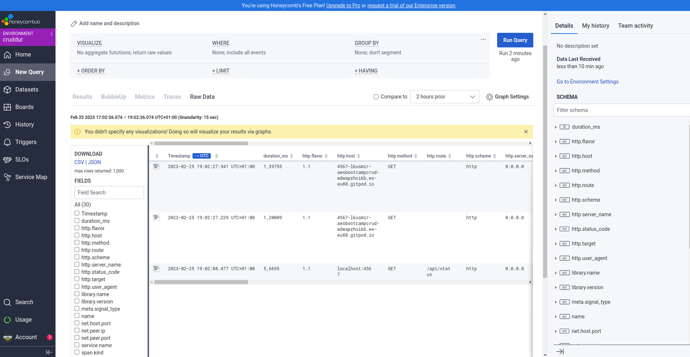
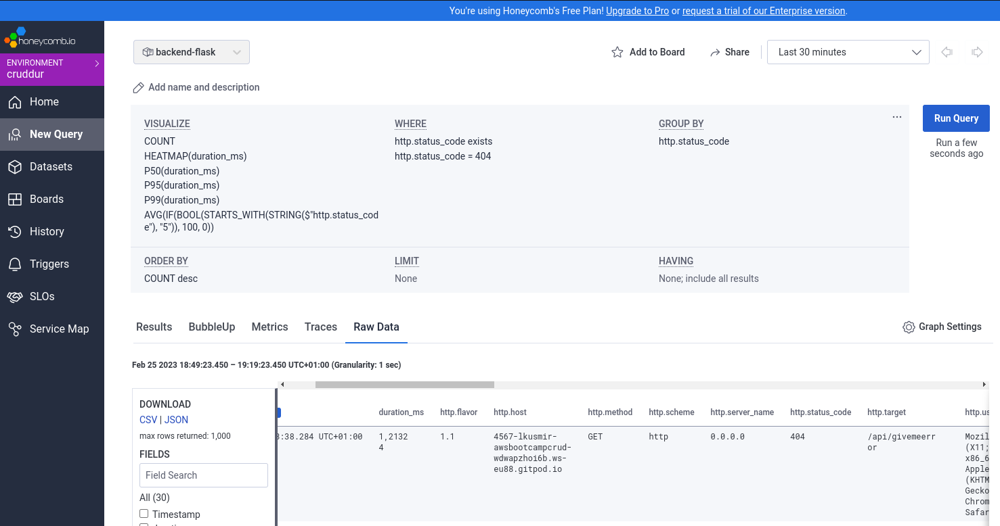
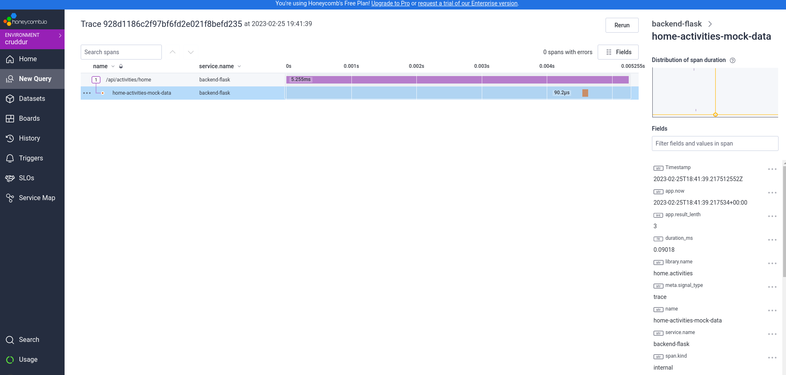
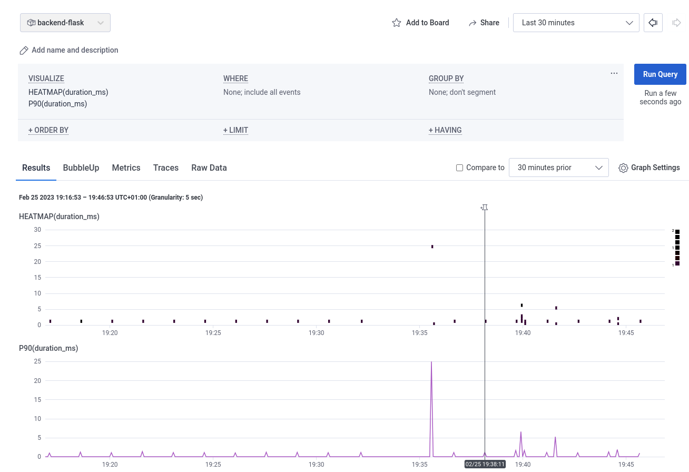
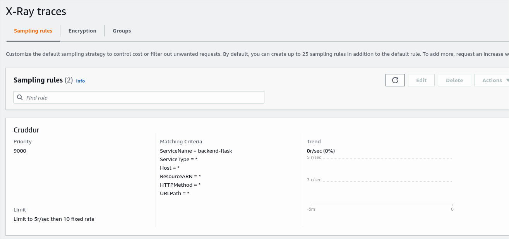
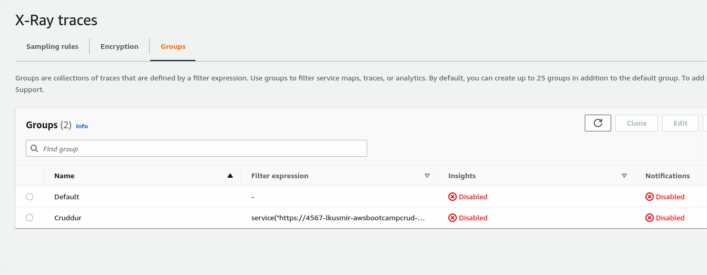
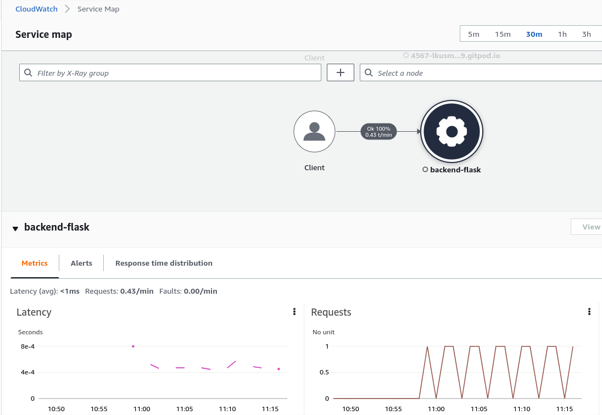
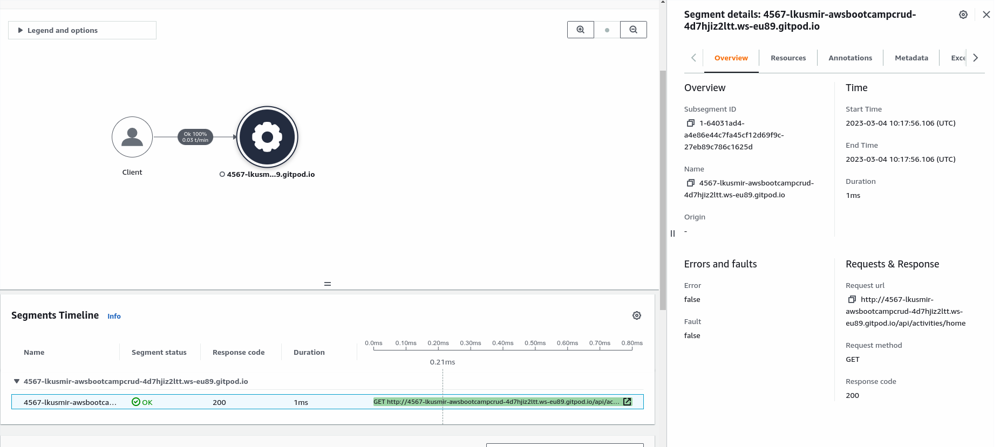
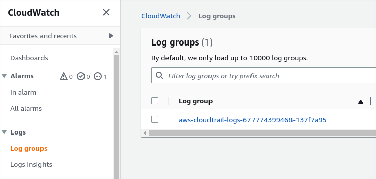

# Week 2 — Distributed Tracing

## Week2 Assignment:

TODO: https://github.com/omenking/aws-bootcamp-cruddur-2023/blob/week-2/journal/week2.md

TODO: https://docs.honeycomb.io/getting-data-in/data-best-practices/

TODO: additional videos for addition assignments

* Instrument Honeycomb for the frontend-application to observe network latency between frontend and backend[HARD]

* Add custom instrumentation to Honeycomb to add more attributes eg. UserId, Add a custom span

Think sth important for instrumentation

* Run custom queries in Honeycomb and save them later eg. Latency by UserID, Recent Traces

Save query by userid or recent traces
https://ui.honeycomb.io/systemadmin/environments/cruddur/datasets/backend-flask/home

## Week 2 notes

With the approach we used in docker compose of setting different service names for frontend and backend(which as far as I understand directs data to  different datasets within honeycomb)will we be able to produce a single trace containing combined latency between them? Can I combine results between datasets or will we have to tweak the approach?
Check it out. - https://docs.honeycomb.io/getting-data-in/data-best-practices/


### Cast

Jessica Kerr - jessitron.com

### Instrument our backend flask application to use Open Telemetry (OTEL) with Honeycomb.io as the provider, Run queries to explore traces within Honeycomb.io

  
*Data visible within the HoneyComb*

[Link to python-honeycomb docs](https://docs.honeycomb.io/getting-data-in/opentelemetry/python/)

  
*GiveMeError analysis within the HoneyComb*

  
*Mocked Trace*

  
*HeatMap of duration*

[honeycomb-whoami](https://honeycomb-whoami.glitch.com)

### Instrument AWS X-Ray into backend flask application

Resources:

[AWS SDK for Python - xray section](https://boto3.amazonaws.com/v1/documentation/api/latest/reference/services/xray.html)

[aws-xray-sdk github](https://github.com/aws/aws-xray-sdk-python)

  
*AWS sampling rule*

  
*AWS sampling group*

```bash
$ wget https://s3.us-east-2.amazonaws.com/aws-xray-assets.us-east-2/xray-daemon/aws-xray-daemon-3.x.deb
aws-xray-daemon-3.x 100%[===================>]   3,48M  2,09MB/s     w 1,7s    
2023-03-04 10:47:16 (2,09 MB/s) - zapisano `aws-xray-daemon-3.x.deb' [3653436/3653436]
$ sudo dpkg -i aws-xray-daemon-3.x.deb 
Wybieranie wcześniej niewybranego pakietu xray.
(Odczytywanie bazy danych ... 435839 plików i katalogów obecnie zainstalowanych.)
Przygotowywanie do rozpakowania pakietu aws-xray-daemon-3.x.deb ...
Preparing for install
Failed to stop xray.service: Unit xray.service not loaded.
Rozpakowywanie pakietu xray (3.3.6) ...
Konfigurowanie pakietu xray (3.3.6) ...
Starting xray daemon
$ sudo systemctl status xray.service 
● xray.service - AWS X-Ray Daemon
   Loaded: loaded (/lib/systemd/system/xray.service; disabled; vendor preset: en
   Active: active (running) since Sat 2023-03-04 10:47:44 CET; 5s ago
 Main PID: 28215 (xray)
    Tasks: 5 (limit: 4915)
   Memory: 14.0M
   CGroup: /system.slice/xray.service
           └─28215 /usr/bin/xray -f /var/log/xray/xray.log

mar 04 10:47:44 bill systemd[1]: Starting AWS X-Ray Daemon...
mar 04 10:47:44 bill systemd[1]: Started AWS X-Ray Daemon.
```

### Configure and provision X-Ray daemon within docker-compose and send data back to X-Ray API

 
*AWS CloudWatch Data*

### Observe X-Ray traces within the AWS Console

  
*AWS Xray Trace*

### Integrate Rollbar for Error Logging

### Trigger an error an observe an error with Rollbar

### Install WatchTower and write a custom logger to send application log data to CloudWatch Log group

### Security Focus Video 

Sending logs from CloudTrail to CloudWatch (brief ):
  
*Log Group Created*


