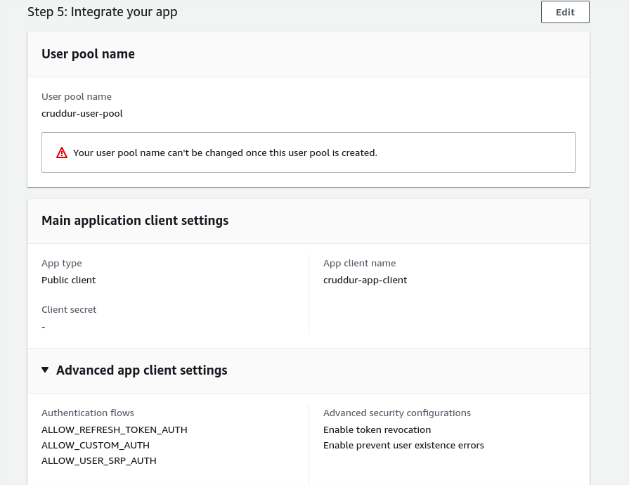

# Week 3 — Decentralized Authentication

## Week3 Assignment

## Week3 Notes

### Cast
Andrew Brown  
[Andrew Brown](https://i.imgflip.com/1tkjq9.jpg)

I branch, you don't branch. Not. It just hurts my eyes.

### Provision via ClickOps a Amazon Cognito User Pool

cruddur-user-pool  
cruddur-app-client  

  
*Cognito user pool names*

### Install and configure Amplify client-side library for Amazon Congito

[Docs](https://docs.amplify.aws/)
[JS Frontend Code](https://docs.amplify.aws/lib/auth/emailpassword/q/platform/js/)

### Implement API calls to Amazon Coginto for custom login, signup, recovery and forgot password page

### Show conditional elements and data based on logged in or logged out
### Verify JWT Token server side to serve authenticated API endpoints in Flask Application
